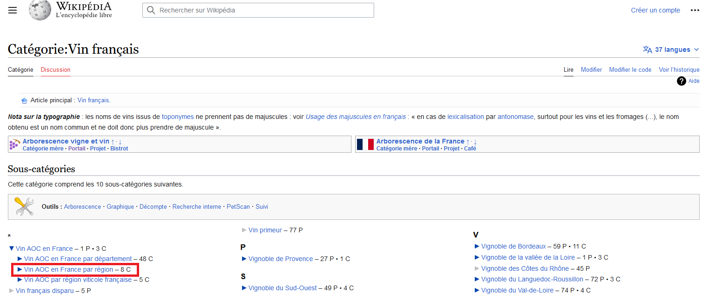

# Crawling wikipedia food categories

This notebook presents the retrieval of some food categories on wikipedia to enrich a dictionary of standardized aliments with some diversity in the products available.
For instance, in [Galiana and Suarez-Castillo (2022)](https://www.linogaliana.fr/talk/goodit22/), we use this approach to enrich [Anses' nutritional dataset called `CIQUAL`](https://ciqual.anses.fr/) with the list of brands or vintages of alcohol available on wikipedia. This makes it possible to take into account the great diversity of French wine names, which are nevertheless not very different from one another in terms of nutritional content. 

The Python code provided in the [`functions.py`](/functions.py) file allows to replicate the main steps of the data recovery.
The later steps for cleaning up the text fields that are presented in [Galiana and Suarez-Castillo (2022)](https://www.linogaliana.fr/talk/goodit22/) are not present in this repository; they will be made public later.

To import all relevent pieces, you just need to run the script as module. Only standard dependencies are used.


## Retrieving French wines

Let's assume we are interested in French wines. The relevent wikipedia category is [this one](https://fr.wikipedia.org/wiki/Cat%C3%A9gorie:Vin_fran%C3%A7ais). 



If we want to retrieve the content of the subcategory _"Vin AOC en France par région"_, we use `fc.dictionnary_by_descending_wiki_child_categories` to crawl the content. To control the number of subcategories we crawl, we use `max_step = 3`. 
If we wanted more diversity in the category, we would have increased the value of this parameter.

```python
dict_wine = fc.dictionnary_by_descending_wiki_child_categories(
    ["Vin_français", "Vin AOC en France par région"],
    max_step = 3)
```

## Using a personal mapping

In this section, we show how to generalize this approach by using a handmade mapping between categories in Wikipedia and in another dataset.

In our case, categories are based on [`CIQUAL` dataset](https://ciqual.anses.fr/).

```python
df = fc.create_dataframe_wikipedia(fc.Wiki_to_ciqual)
```

